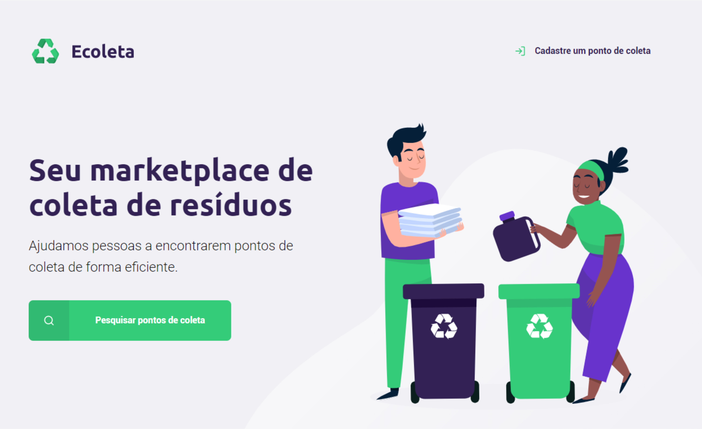
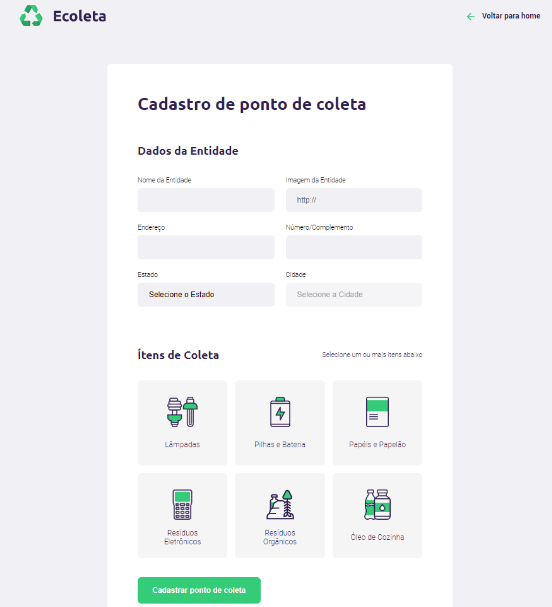
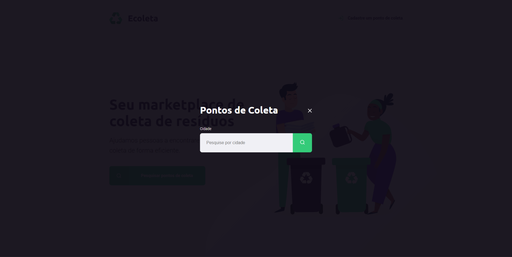
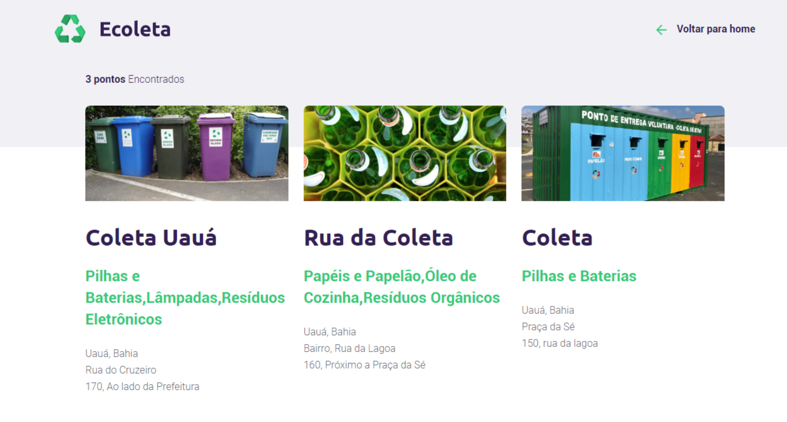

<h1 align="center">
   
</h1>

<h1> 

   
</h1>

## 📋 Sobre

O projeto **Ecoleta** é um marketplace que tem como objetivo principal, encontrar pontos de coleta de forma eficiente. Desenvolvido na Next Level Week #1

---

## 🚀 Tecnologias utilizadas
- JavaScript
- Node.js
- HTML
- CSS
- SQLite
<h2 align="center"> 💻Apresentação: </h2>

## Cadastrar ponto de coleta:

## Pesquisar ponto de coleta:

## Resultado da busca:

---

### *Desenvolvido por Lucas Rodrigues*🚀💻

